## Hi there 👋
I'm a hobbyist and programmer from Japan.
## Language
### main

### i can
scratch, smali, hsp, 
### a little
asm(arm64), 
## Interests
### Reverse Engineering
I Like Cheat, Hack, Mod, Macro, Decompile ...and so on.

I recently learned how to read IDA.
### Game
I want to make a game someday.
### 3D Model
I've always wanted to create 3D models, and I've made a few using Tinkercad and Blockbench.
### GUI Development
Since I use C#, I enjoy creating GUIs.

I'm always thinking about GUIs that prioritize user experience.

## Projects

### [Fake_CCAPI_For_RPCS3](https://github.com/knms360/Fake_CCAPI_For_RPCS3)

Use RTM to RPCS3

### [VRC Fish Macro](https://github.com/knms360/vrc-fish-macro)

Macro for VRC Fish!

## Status

<!--
**knms360/knms360** is a ✨ _special_ ✨ repository because its `README.md` (this file) appears on your GitHub profile.

Here are some ideas to get you started:

- 🔭 I’m currently working on ...
- 🌱 I’m currently learning ...
- 👯 I’m looking to collaborate on ...
- 🤔 I’m looking for help with ...
- 💬 Ask me about ...
- 📫 How to reach me: ...
- 😄 Pronouns: ...
- ⚡ Fun fact: ...
-->
